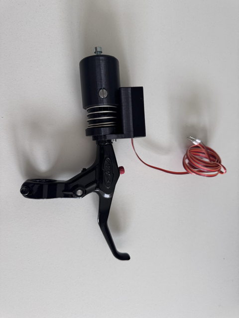
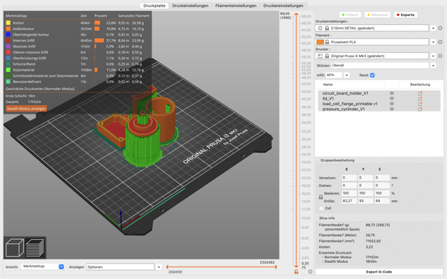
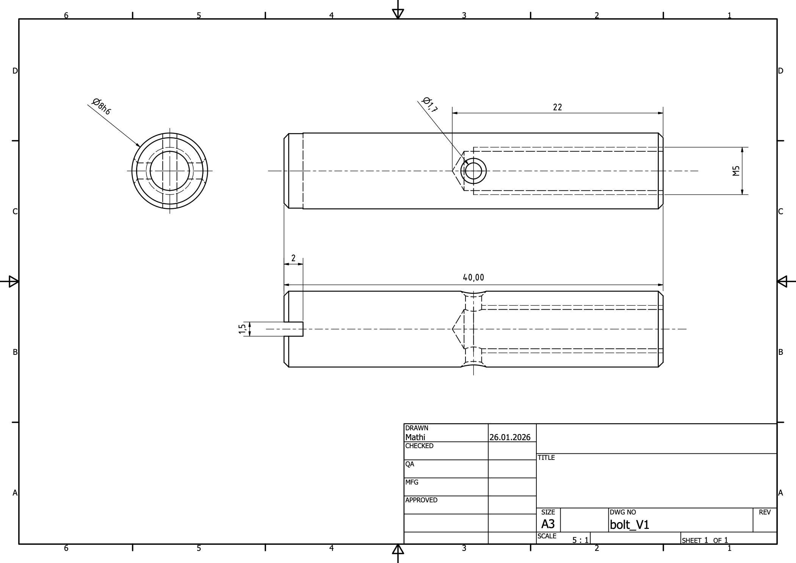
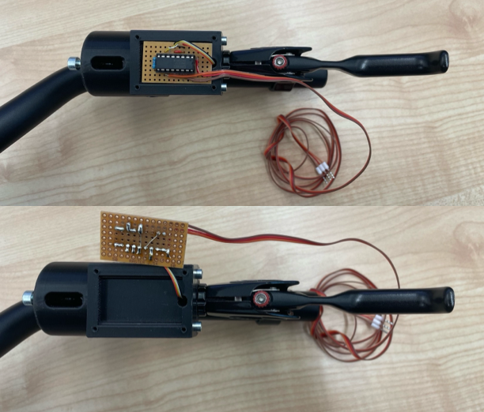

This documentation explains how to manufacture and assemble an electronic brake for application in a bicycling simulator. It is based on an off-the-shelf bicycle brake lever and uses a load cell to convert the manual force to a digital signal. 
# Introduction 
The brake subsystem detects a bicyclist’s deceleration input to modulate longitudinal speed. Previous **mechanical** and **mechatronic** approaches achieve this through distinct methods:
- **Mechanical systems** use hand-operated brake levers or back-pedal brakes to slow a rotating component in the resistance subsystem, enabling speed derivation from rotational measurements.
- **Mechatronic systems** convert physical braking actions into electronic signals for the bicycling dynamics subsystem. Common solutions include:
    - Force sensors measuring applied braking pressure.
    - Displacement sensors tracking longitudinal or rotational movement (e.g., brake levers, crank-based back-pedal motion).
    - Simplified push-button inputs for basic control.

**Key consideration:** Ensure the chosen method aligns with the simulator’s fidelity requirements and hardware integration constraints for accurate, responsive braking behaviour.
<a id="Figure_1"></a>

*Figure 1 System overview: Sensors and actuators*
# Technical Overview
## Handlebar Integration and Signal Processing
This brake module is designed for **direct mounting onto standard bicycle handlebars**, using the **[Avid Speed Dial 7 by SRAM](https://www.sram.com/de/sram/models/bl-sd-7-a1)**. The Avid Speed Dial 7 was selected for its **versatility**—it mounts on either side of the handlebar and offers **adjustable tension and lever angle**, ensuring compatibility with diverse setups.
**Key advantages over previous designs:**
- **Compact assembly**: Attaches solely to the handlebar, eliminating the need for mechanical or hydraulic brake calipers.
- **Pressure sensing**: A **miniature load cell** embedded in the module measures applied brake pressure. The signal is **amplified**, digitised by an **Arduino**, and transmitted to the simulation computer via **UDP**.

[Figure 2](#Figure_2) shows the complete brake module with a three-core ribbon cable to be connected to the Arduino. The signal processing chain is shown in [Figure 3](#Figure_3)

<a id="Figure_2"></a> 
*Figure 2 Brake Module for installation on an off-the-shelf bicycle handle bar*

<a id="Figure_3"></a> 
*Figure 3 Brake Module signal transmission and processing*

## Brake Modul Wiring and Arduino Code
For the electronic implementation with an Arduino Uno we followed the documentation ["Working with a Load Cell and an Arduino"](https://edg.uchicago.edu/tutorials/load_cell/) published by the University of Chicago. Please refer to this document for all details on the wiring and Arduino code. 
## Assembly Drawing and Bill of Materials (BOM)
Below [Figure 4](Figure_4) shows the assembly drawing of the brake sensor without the brake lever while [Figure 5](Figure_5) shows the exploded view and BOM for the complete assembly with a demonstrative brake lever dummy similar to the model we used. 
<a id="Figure_4"></a> *Figure 4 Brake Module Assembly Drawing*
<a id="Figure_5"></a> *Figure 5 Brake Module Exploded View Drawing with Part List*
  
**Table 2 Bill of Materials (BOM)**

| **Item** | **Qty** | **Part Name**             | **Part Name / Reference**                   | **Description**                                                                                                                                                                                 | **Material/ Standard**      | **Remarks**                                                                                                                                                                                                                                      |
| -------- | ------- | ------------------------- | ------------------------------------------- | ----------------------------------------------------------------------------------------------------------------------------------------------------------------------------------------------- | --------------------------- | ------------------------------------------------------------------------------------------------------------------------------------------------------------------------------------------------------------------------------------------------ |
| 1        | 1       | `Load Cell Flange`        | Load_cell_flange_V1                         | 3D-printed structural part that holds the load cell and screws into the brake lever.                                                                                                            | 3D Filaments PLA (1.75 mm)  | [3D Filaments PLA link](https://www.3dmensionals.de/3dmensionals-pla-filament-2580?number=PSU3DM001V.2#attr=11255,11254,11271,4165,4164,21806,23697,24892,25436)                                                                                 |
| 2        | 1       | `Pressure Cylinder`       | Pressure_cylinder_V1                        | 3D-printed structural part that converts brake-cable tension into axial force onto the load cell.                                                                                               | 3D Filaments PLA (1.75 mm)  | [3D Filaments PLA link](https://www.3dmensionals.de/3dmensionals-pla-filament-2580?number=PSU3DM001V.2#attr=11255,11254,11271,4165,4164,21806,23697,24892,25436)                                                                                 |
| 3        | 1       | `Bolt`                    | Bolt_V1                                     | Manufactured steel bolt for connecting cylinder and brake cable.                                                                                                                                | Precision Steel 8h6, 1.4301 | [Reely shaft – Conrad](https://www.conrad.de/de/p/silberstahl-welle-reely-o-x-l-8-mm-x-500-mm-237205.html)                                                                                                                                       |
| 4        | 1       | `Spring`                  | Spring_V1                                   | Spring to restore the position of brake lever and pressure cylinder when releasing manual brake force                                                                                           | EN 10270-1                  | [Compression Springs D-206A-20, Steel Ø 1.4 x 32.6 x 54 mm](https://www.federnshop.com/en/products/compression_springs/d-206a-20.html)                                                                                                           |
| 5        | 1       | `Circuit Board Holder`    | Circuit_board_holder_V1                     | Enclosure base for the amplifier circuit board. Includes mounting features and cable paths.                                                                                                     | 3D Filaments PLA (1.75 mm)  | [3D Filaments PLA link](https://www.3dmensionals.de/3dmensionals-pla-filament-2580?number=PSU3DM001V.2#attr=11255,11254,11271,4165,4164,21806,23697,24892,25436)                                                                                 |
| 6        | 1       | `Lid`                     | Lid_V1                                      | Covers encloser containing amplifier.                                                                                                                                                           | 3D Filaments PLA (1.75 mm)  | [3D Filaments PLA link](https://www.3dmensionals.de/3dmensionals-pla-filament-2580?number=PSU3DM001V.2#attr=11255,11254,11271,4165,4164,21806,23697,24892,25436)                                                                                 |
| 7        | 1       | `Load Cell`               | C-20009605-14                               | TE-Connectivity load cell model FX292X-100A-0050-L                                                                                                                                              | Steel                       | [TE-Connectivity FX292X-100A-0050-L](https://docs.rs-online.com/872b/A700000007147071.pdf)                                                                                                                                                       |
| 8        | 1       | `Brake Lever`             | Brake_lever_dummy                           | Brake lever for cable operated brakes with an M10 x 1 mm thread for cable tension adjustment.                                                                                                   | Aluminium Alloy             | [Avid Speed Dial 7 by SRAM ](https://www.sram.com/de/sram/models/bl-sd-7-a1)                                                                                                                                                                     |
| 9        | 1       | `Brake Cable`             | Brake_cable                                 | Standard bicycle brake cable                                                                                                                                                                    | Steel cable                 | [SRAM Brake Cable Stainless Steel MTB V2 \| 2000 mm](https://r2-bike.com/SRAM-Brake-Cable-Stainless-Steel-MTB-V2-2000-mm_1 "SRAM Brake Cable Stainless Steel MTB V2 \| 2000 mm")                                                                 |
| 10       | 1       | `Amplifier Circuit Board` | Circuit Board                               | Grid circuit board to be cut to fit the enclosure. Holds amplifier and connects wires. The board needs to have a grid scheme of 2.54mm to match the pins of the amplifier. Not shown in drawing | Laminated circuit board     | [Rademacher WR Type 790-5 Circuit Board Hard Paper (L x W) 160 mm x 100 mm 35 µm Grid Size 2.54 mm](https://www.conrad.de/de/p/rademacher-wr-typ-790-5-platine-hartpapier-l-x-b-160-mm-x-100-mm-35-m-rastermass-2-54-mm-inhalt-1-st-529618.html) |
| 11       | 1       | `Amplifier`               | Burr-Brown INA125 Instrumentation Amplifier | Amplifies load cell signal for transmission to Arduino. Not shown in drawing.                                                                                                                   | Semi-conductor              | [Burr-Brown INA125 Instrumentation Amplifier](https://edg.uchicago.edu/tutorials/load_cell/80126.pdf)                                                                                                                                            |
| 12       | 1       | `Resistor`                | 1 kOhm Resistor                             | Resistor for connecting the amplifier                                                                                                                                                           | standard carbon resistor    |                                                                                                                                                                                                                                                  |
# Building Instructions

## Manufacturing the Parts

### 3D Printing
To fabricate the mechanical components of the speed sensor system, we employed Fused Filament Fabrication (FFF) (a common 3D printing method that extrudes molten plastic layer by layer) using a Prusa i3 MK3 3D printer. This section provides key technical parameters and setup configurations to ensure reproducibility of the print results with similar quality and structural integrity.

> [!Warning] **Note:**
> Please note that in the original Inventor load_cell_flange.ipt the M10 x 1 thread is  not modelled, because Inventor can't do it easily. That's why the model has been imported to Fusion to create the version load_cell_flange_printable v1.step which has a modelled thread which can be printed.

 **Table 3 3D printing information**

| **Parameter**        | **Value**                                      |
| -------------------- | ---------------------------------------------- |
| Printer Model        | Prusa i3 MK3                                   |
| Slicing Software     | PrusaSlicer 2.9.1 (based on Slic3r)            |
| Layer Height         | 0.15 mm (fine resolution)                      |
| Infill Density       | 40%                                            |
| Infill Pattern       | Default (as configured in slicer)              |
| Supports             | Enabled (automatically generated)              |
| Material Type        | PLA (assumed default for ABS-compatible setup) |
| Estimated Print Time | \~17 hours 52 minutes (total)                  |
| Filament Consumption | \~29.75 meters (\~71552.92 mm³)                |

> [!Warning] **Note:** 
> Automatic supports were essential for maintaining bore hole geometry, particularly in overhang regions where drooping or collapse may otherwise occur during printing.

Additional Recommendations:
- Post-processing: After printing, components were deburred and cleaned to remove any support material and residual brim structures. This ensures tight fits between bearings, shafts, and sensor housings.
- Tolerance Fit: It is recommended to maintain ±0.05 mm tolerance for critical bore fits, especially for bearing seats and shaft passages.

<a id="Figure_6"></a> 
*Figure 6 Screen shot Prusa G-code Viewer*

The screenshot ([Figure 6](#Figure_6)) from Prusa G-code Viewer shows the exact layout and orientation of all parts on the printer tray during printing. This is critical for:
- Ensuring flat-base printing and stable adhesion to the build plate
- Maintaining correct dimensional references for mating parts
- Minimizing support material in critical surface areas

The g-code can be found under following file path:
```
CAD_and_print\\hand_brake_1.0\\3D-print\\brake_V1_0.1mm_PLA_MK3_17h56m.gcode
```
### Manufacturing the Bolt (3)
The `bolt (3)` is made according to the manufacturing drawing shown in [Figure 7](#Figure_7)  using a length of precision steel rod 8h6, 1.4301 (grinded stainless steel) following these steps: 
1. Cut a piece of 42mm from the rod and deburr the sharp ends
2. Use a lathe to turn the ends of the bolt flat and bring the bolt to a length of 40 mm (+/-0.5 mm).
3. Use the lathe to drill a centric M4 threaded bore with a drilling depth of 22 mm (+/-0.5 mm) from one end of the bolt.
4. Use the drill press to drill a radial through bore with a diameter of 2.5 mm (+/-0.2 mm) exactly halfway along the length of the bolt.
5. Use a saw to cut the slot in the end opposite the axial thread. The slot should align with the radial bore. The slot should fit a flat blade screw driver so that it can be used to align the radial bore later in the assembly process. 
6. Deburr all sharp edges and clean bolt from residual cutting oil.
<a id="Figure_7"></a> 
*Figure 7 Manufacturing drawing of the bolt (3)*
## Mechanical Assembly
The following steps provide a procedure to ensure your mechanical assembly of the steering sensor is precise and reliable.

1. Take the `load cell flange (1)` and melt [M4 x 8.1 heat set inserts](https://cnckitchen.store/de/products/heat-set-insert-m4-x-8-1-50-pieces) into the holes on the plane surface on the side of the M10 x 1 thread. These will later mount the `circuit board holder (5)`.    
2. Take the `load cell (7)` and carefully slide its wire through the small hole in the seat in the `load cell flange (1)`. It should emerge at the other end of the `load cell flange (1)` next to the thread which later screws into the brake lever. If it does not slide easily, use a drill or steel wire to clean the hole. Then carefully press the `load cell (7)` into the seat in the `load cell flange (1)` while gently pulling the wire so that it does not fold. Make sure the `load cell (7)` sits evenly and at the very bottom of the seat.    
3. Take the `pressure cylinder (2)` and melt a [M5 x 9.5 heat set insert](https://cnckitchen.store/products/heat-set-insert-m5-x-9-5-50-pieces) (not shown in the drawing) into the center hole in its cap. Insert a M5 x16 screw with nut (not shown in the drawing) which will later be used to adjust the pressure point.    
4. First slide the `spring (4)` onto the `load cell flange (1)` and then the `pressure cylinder (2)`. Make sure the cylinder moves smoothly over the flange. If not, use sandpaper to grind the flange smooth.    
5. Press the `bolt (3)` through the radial hole in the `pressure cylinder (2)` so that it reaches through the slotted hole in the `load cell flange (1)`. The radial bore in the `bolt (3)` should be aligned with the rotation axis of the `load cell flange (1)` by manipulating the bolt via the slot and a flat blade screw driver. Again, check for smooth movement and disassemble and grind the slotted hole if needed.    
6. Take the `circuit board holder (5)` and slide the wire of the `load cell (7)` through it so that it emerges in the seat of the enclosure which will later hold the circuit board. Use M4 x 8 screws (not shown in the drawing) to mount the `circuit board holder (5)` onto the `load cell flange (1)`.    
7. Take the `brake lever (8)`, remove the screw for adjusting the cable tension, and insert the brake cable as per manufacturer instructions.    
8. Take the pre-assembled `load cell flange (1)` and hold it next to the `brake lever (8)` to estimate the required cable length. It should reach through the bore in the `bolt (3)` with 3 to 6 mm additional length when the `brake lever (8)` is not pulled and the `pressure cylinder (2)` is pushed to the far end by the `spring (4)`. Cut the `brake cable (9)` to length with a sharp cable cutter to prevent splicing of the cable.    
9. Slide the `brake cable (9)` through the center bore in the `load cell flange (1)` and the radial bore of the `bolt (3)` while screwing the flange into the M10 x 1 thread of the `brake lever (8)`. Be careful to prevent splicing of the cable.    
10. Check the correct length of the cable. Then insert a M4 threaded pin (not shown in the drawing) into the centric bore of the `bolt (3)`. Tighten it to clamp the cable in the `bolt (3)`.    
11. Check the correct function of the mechanism by pulling and releasing the `brake lever (8)`. The `pressure cylinder (2)` should slide smoothly and there should be no loud sounds.    
12. Now the assembly is ready for installation of the `circuit board (10)`.
### Manufacturing and Installing the Amplifier Circuit Board (10)
The `circuit board (10)` is used to hold the `amplifier (11)` and connect it to the wires of the `load cell (7)` and to the wires routing to the Arduino. For manufacturing a raw laminated circuit board with a grid size of 2.54mm is used. [Figure 8](#Figure_8) shows the assembled circuit board installed on the brake module. Please follow these steps for manufacturing: 
1. Cut a piece tightly fitting the enclosure in the `circuit board holder (5)` from the raw circuit board. Deburr the sharp edges. 
2. Carefully place the `amplifier (11)` in the center of the `circuit board (10)` by pushing the pins through the holes. The copper coated side of the `circuit board (10)` should face away from the `amplifier (11)`
3. Bend the wires of the `1 k Ohm resistor (12)` 90° and slide it into the `circuit board (10)` parallel to the `amplifier (11)`. Solder the ends to fix it in place, then cut protruding ends short. 
4. Strip 2mm of the `load cell's (7)` cable ends and put them into holes next to the pins of the `amplifier (11)` which they are to be connected with. Note: Please consult the [Load cell with Arduino](https://edg.uchicago.edu/tutorials/load_cell/) documentation for the connections.
5. Take a length of three-core ribbon cable just long enough to connect the module to the Arduino. Strip 2mm of the cables ends and put them into holes of the `circuit board (10)`. Again please refer to the documentation to find the best locations. 
6. Use thin isolated copper strands to make the connections between  `amplifier (11)` pins, `load cell (7)` wires and the ribbon wire to the Arduino according to the documentation.
7. Make sure the soldered connections are electrically conductive and there are no unintended short circuits. I necessary isolate with tape. 
8. Push the `circuit board (10)` into the seat inside the `circuit board holder (5)` while arranging all wires in place. The `load cell's (7)` wires should go under the circuit `board (10)` and the Arduino cables should be on top routing out at the side facing towards the `brake lever (8)`. 
9. Use four M2.5 x 8 fillister head screws (not shown in drawing) to install the `lid (6)` onto the `circuit board holder (5)`. The recess in the bottom of the `lid (6)` should go over the Arduino wires and gently press against them to hold them in place. 

<a id="Figure_8"></a> 
*Figure 8 pictures of the amplifier circuit board (10) installed on the brake module*
### Connection to Arudino and Testing
Again, please refer to the [Load cell with Arduino](https://edg.uchicago.edu/tutorials/load_cell/) documentation to connect the wires with the Arduino and test the functionality of the electronics.  
# Software
The software for the Arduino and the interface to the simulation computer is documented in a separate repository which can be found under following link:

```
\>\>\>\>\>\>\>\>\>\>\>\> ADD LINK TO ABOOZAR'S DOC\<\<\<\<\<\<\<\<\<\<\<

```

# Known Limitations and Potential for Improvement
While the presented brake module has strong advantages in its compact design and ease of implementation via an Arduino microcontroller, there are also some limitations to this technical solution which are listed below: 

- The **assembly of the brake cable is tricky** and needs some skill to prevent splicing of the cable.
- The signal is transferred as **analog** from brake to Arduino which may cause problems with the cable getting longer
	- An analog to digital converter directly on the brake module would be ideal. 
- When pulling the lever the i**ncrease of pressure over lever angle is very abrupt**. Once the adjustment screw in the `pressure cylinder (2)` hits the `load cell (7)` the increase in pressure is very steep while the lever angle does not increase much.  
	- A pressure spring between adjustment screw and `load cell (7)` would be very useful to improve the realism of the haptic feel. 

