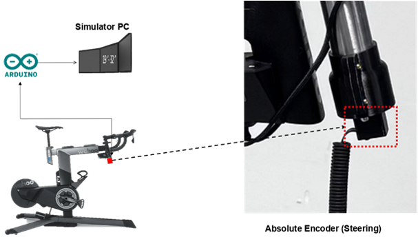
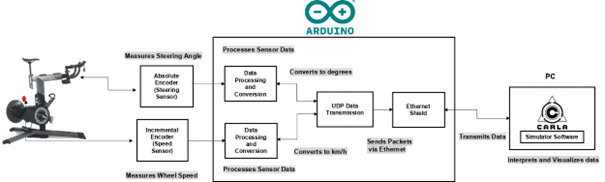
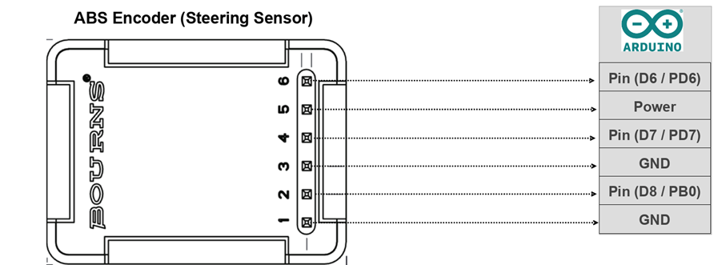
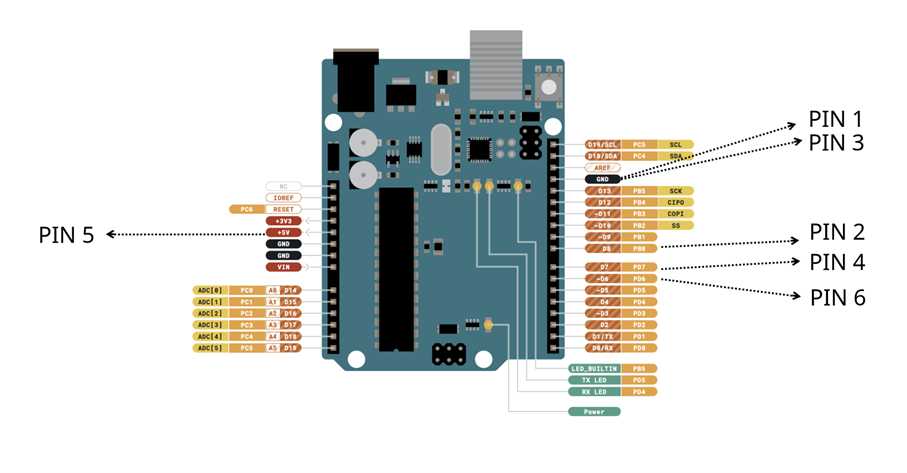
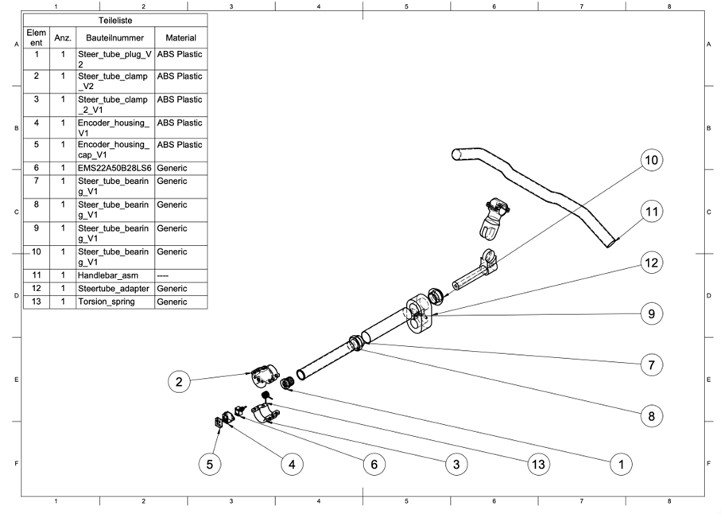
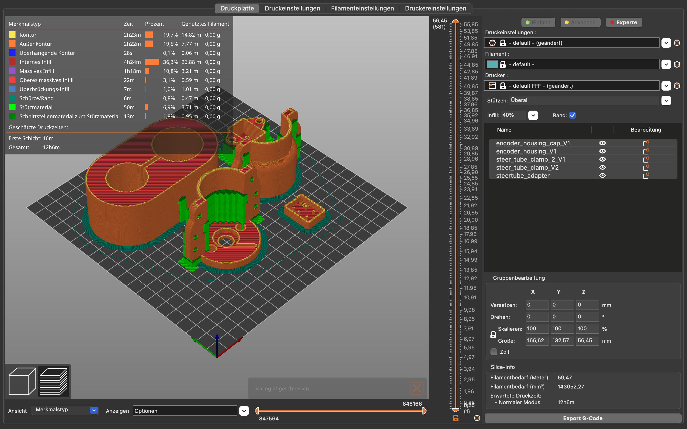

This documentation explains how to manufacture and assemble a handle bar with steer angle measuring sensor for application in bicycling simulator. 
# Introduction 
In a virtual reality bicycling simulator, steering input plays a crucial role in bringing realism to the experience. While pedalling dynamics and resistance are commonly addressed through standard trainer setups, accurate and responsive steering is not readily available as off-the-shelf product.
To enable low-latency, high-precision steering in the simulator, we integrated a dedicated sensor module into the handlebar assembly. At the core of this module is an absolute rotary encoder that directly measures the steering angle as the user turns the handlebars. Unlike incremental encoders or other indirect sensors, the absolute encoder provides a stable, always-referenced angle meaning it never loses track of its position, even if the system is restarted or repositioned.
The encoder is mounted at the base of the handlebar stem and mechanically coupled to the rotation axis. The angle data is read by an Arduino Uno the same microcontroller that handles speed measurement which processes the signal and converts the raw sensor output into rotational degrees. The converted data is then sent to the simulation PC using UDP over Ethernet, where it is interpreted by the CARLA environment in real time. This setup ensures minimal latency and smooth, continuous steering input within the simulation.
The goal of this documentation is to describe the steering sensor module as an open-source component of the simulator. It includes all necessary information to replicate the hardware setup, interface it with the Arduino, and integrate it into your simulator hardware. The software is documented in a separate document. By providing both technical detail and practical assembly guidance, this documentation supports reuse, modification, and further development in similar simulator projects.
<a id="Figure_1"></a>

*Figure 1 System overview: Sensors and actuators*
# Technical Overview

## Steering Sensor Module Connection to Kickr Bike
<a id="Figure_2"></a> 

*Figure 2 Mechanical integration - Steering Sensor Module Connection to*
*Kickr Bike*

<a id="Figure_3"></a> 
*Figure 3 Steering sensor signal transmission and processing*

Note: [Figure 3](#Figure_3) shows the full signal chain for steering: the absolute encoder is read by the Arduino and transmitted via UDP to the simulation PC. A separate document covers the speed module in the same structure as this steering documentation.
### System Integration and Function
As shown in  [Figure 3](#Figure_3), the steering sensor is mounted directly to the handlebar stem using a fixed bracket that aligns the shaft of the rotary encoder with the bike's steering axis. The encoder used is a 10-bit absolute rotary encoder (e.g., Bourns EMS22A50), which captures the handlebar's  angular position without the need for homing or recalibration after powering up. Thanks to its compact design and SPI-based digital interface, the sensor provides stable and precise steering angle measurements in real time.

The absolute encoder outputs a 10-bit digital value representing the absolute rotational position of the handlebar. It is connected to the Arduino using six wires: three signal lines (Clock, Chip Select, and Data Out), two ground lines (both tied to Arduino GND for stable reference), and one power line (5 V). This configuration ensures clean and reliable synchronous serial communication for real-time acquisition of the steering angle.

The Arduino polls the encoder at a fixed frequency, reads the digital output, and converts the raw signal into a meaningful steering angle in degrees. After applying a fixed offset and, if necessary, a calibration factor, the angle is mapped into a normalized format compatible with the simulation software.

As illustrated in the system block diagram, the Arduino handles the following tasks:
- Polling the absolute encoder to retrieve the latest steering position,
- Converting the raw sensor data into a readable steering angle,
- Transmitting the processed angle to the simulation PC via UDP over
  Ethernet.

This integration provides a direct and highly responsive feedback loop between the physical steering input and the virtual simulation. The minimal latency and consistent accuracy of this setup allow for natural rider control and precise steering dynamics within the virtual environment.

With the functional role of the steering sensor established, the next section outlines how the encoder is electrically connected to the Arduino, ensuring proper signal acquisition and stable communication during operation.
## Steering Sensor Wiring to Arduino 

<a id="Figure_4"></a> 
*Figure 4 Electrical integration - Steering Sensor Wiring Connection to Arduino*

 **Table 1 Steering Sensor Wiring**

| **Pin \# (Encoder)** | **Signal**       | **Wire Colour** | **Arduino Connection** | **Description**                  |
| -------------------- | ---------------- | --------------- | ---------------------- | -------------------------------- |
| 1                    | DI (Data In)     | Blue            |                        | Common ground                    |
| 2                    | CLK (Clock)      | Green           | Pin (D8 / PB0)         | DigitalWrite (output to encoder) |
| 3                    | GND              | Yellow          | GND                    | Common ground                    |
| 4                    | DO (Data Out)    | Orange          | Pin (D7 / PD7)         | DigitalRead (input from encoder) |
| 5                    | VCC (+5 V)       | Red             | Power                  | Powers the encoder               |
| 6                    | CS (Chip Select) | Brown           | Pin (D6 / PD6)         | DigitalWrite (output to encoder) |
<a id="Figure_5"></a> 
*Figure 5 Steering Sensor Wiring connection through Arduino to simulator software*
### Connection Overview and Hardware
The diagram above shows how the steering sensor is connected to the Arduino Uno to enable real-time angle detection on the Kickr Bike. The sensor used here is a 10-bit absolute rotary encoder, and it communicates with the Arduino via a simple synchronous serial interface. Each of its wires serves a specific function and is routed to a corresponding Arduino pin:

Power Supply (5 V & GND) -- The encoder is powered through the Arduino's 5 V and GND pins, connected to the encoder's red (VCC) and violet (GND) wires respectively.

Signal Pins (DO, CLK, CS) -- The encoder's three communication lines are:
- DO (Data Out) -- orange wire, connected to Arduino digital pin D7, used to read the angular data.
- CLK (Clock) -- green wire, connected to Arduino digital pin D8, used to clock the data bits out of the encoder.
- CS (Chip Select) -- brown wire, connected to Arduino digital pin D6, used to initiate each read operation.

A sixth wire (blue) corresponds to DI (Data In) but is not used in this setup.

This configuration allows the Arduino to continuously poll the encoder and retrieve the current handlebar position. Since the encoder provides absolute values, there is no need to track previous rotations or recalibrate at startup. As always, care should be taken to ensure secure and clean wiring. Proper connections are essential not only for accurate signal reading but also to prevent noise, data glitches, or unexpected disconnections during simulation use.
## Assembly Drawing and Bill of Materials (BOM)
<a id="Figure_6"></a> 
*Figure 6 Assembly Drawing of the Steering Sensor*
  
**Table 2 Bill of Materials (BOM)**

|          |         |                                      |                                                                                              |                                                                                                                                                                                                                                                                                                                                                                            |                                    |
| -------- | ------- | ------------------------------------ | -------------------------------------------------------------------------------------------- | -------------------------------------------------------------------------------------------------------------------------------------------------------------------------------------------------------------------------------------------------------------------------------------------------------------------------------------------------------------------------- | ---------------------------------- |
| **Item** | **Qty** | **Part Name / Number**               | **Function / Description**                                                                   | **Material / Type**                                                                                                                                                                                                                                                                                                                                                        | **Remarks**                        |
| 1        | 1       | Steer_tube_plug _V2                  | Mounting plug securing the encoder housing to the steer tube.                                | 3DFilaments PLA (1.75 mm)                                                                                                                                                                                                                                                                                                                                                  | 3D printed component               |
| 2        | 1       | Steer_tube_clamp _V2                 | Clamp for fixing the encoder housing to the steering column.                                 | 3DFilaments PLA (1.75 mm)                                                                                                                                                                                                                                                                                                                                                  | 3D printed component               |
| 3        | 1       | Steer_tube_clamp _2 _V1              | Secondary clamp providing alignment and vibration damping.                                   | 3DFilaments PLA (1.75 mm)                                                                                                                                                                                                                                                                                                                                                  | 3D printed component               |
| 4        | 1       | Encoder_housing _V1                  | Protective enclosure for the absolute encoder.                                               | 3DFilaments PLA (1.75 mm)                                                                                                                                                                                                                                                                                                                                                  | 3D printed component               |
| 5        | 1       | Encoder_housing_cap _V1              | Top cap sealing the encoder housing and routing the cable exit.                              | 3DFilaments PLA (1.75 mm)                                                                                                                                                                                                                                                                                                                                                  | 3D printed component               |
| 6        | 1       | EMS22A50B28LS6 (Bourns)              | 10-bit absolute rotary encoder for steering angle measurement.                               | [https://www.bourns.com/pdfs/EMS22A.pdf?utm_source=chatgpt.com](https://www.bourns.com/pdfs/EMS22A.pdf?utm_source=chatgpt.com)                                                                                                                                                                                                                                             | -                                  |
| 7        | 1       | Steer_tube_bearing _V1 (upper)       | Upper bearing ensuring smooth rotation of the steering axis.                                 | [https://www.zweiradnetz.de/lenker/steuersatz/gewindesteuersatz-contec-hs-30-schwarz-1-1-8-kaufen](https://www.zweiradnetz.de/lenker/steuersatz/gewindesteuersatz-contec-hs-30-schwarz-1-1-8-kaufen)                                                                                                                                                                       | -                                  |
| 8        | 1       | Fork Cone                            | Conical seat connecting the steer tube to the fork assembly; provides axial load support.    | [https://www.zweiradnetz.de/lenker/steuersatz/gewindesteuersatz-contec-hs-30-schwarz-1-1-8-kaufen](https://www.zweiradnetz.de/lenker/steuersatz/gewindesteuersatz-contec-hs-30-schwarz-1-1-8-kaufen)                                                                                                                                                                       | -                                  |
| 9        | 1       | Steer Tube                           | Central shaft of the steering column around which the handlebar rotates.                     | 1 ⅛″ steerer (inner tube), Ø 28.6 mm OD with a 30.0 mm crown-race seat, length ~200 mm; compatible with the CONTEC HS-30 headset and the Columbus 36/34 mm head tube                                                                                                                                                                                                       | -                                  |
| 10       | 1       | Steer_tube_bearing _V1 (lower)       | Lower bearing supporting the steering shaft.                                                 | [https://www.zweiradnetz.de/lenker/steuersatz/gewindesteuersatz-contec-hs-30-schwarz-1-1-8-kaufen](https://www.zweiradnetz.de/lenker/steuersatz/gewindesteuersatz-contec-hs-30-schwarz-1-1-8-kaufen)                                                                                                                                                                       | Press-fit                          |
| 11       | 1       | Handlebar dummy                      | Simplified handlebar element for simulator integration.                                      | Generic (link)                                                                                                                                                                                                                                                                                                                                                             | Represents real handlebar geometry |
| 11.1     | 1       | Stem (quill)                         | CONTEC Tarantula Stick                                                                       | [https://www.contec-parts.com/en/products/bike-parts/stems-headsets/stems/03166451-contec-stem-tarantula-stick/?utm_source=chatgpt.com](https://www.contec-parts.com/en/products/bike-parts/stems-headsets/stems/03166451-contec-stem-tarantula-stick/?utm_source=chatgpt.com)                                                                                             | -                                  |
| 11.2     | 1       | Head tube (outer)                    | Columbus CYRK18600 - Headtube- HT ( Ø - 36mm Durchmesser außen, innen 34mm, Wandstärke: 1.1) | [https://framebuildersupply.com/products/columbus-zona-headtube-36-dia-1-1mm-wall-length-600?srsltid=AfmBOopjncn9SwTlXKOKhYActr_Q6pIiZgMWsWv-knVpJCbeKm6urB78&utm_source=chatgpt.com](https://framebuildersupply.com/products/columbus-zona-headtube-36-dia-1-1mm-wall-length-600?srsltid=AfmBOopjncn9SwTlXKOKhYActr_Q6pIiZgMWsWv-knVpJCbeKm6urB78&utm_source=chatgpt.com) | -                                  |
| 11.3     | 1       | Threaded inserts (for printed parts) | ruthex RX-M5×9.5 (M5)                                                                        | [https://www.3dmensionals.de/cnc-kitchen-set-gewindeeinsaetze-2166?number=PACCK0010V.1#attribute_values=1278,2513](https://www.3dmensionals.de/cnc-kitchen-set-gewindeeinsaetze-2166?number=PACCK0010V.1#attribute_values=1278,2513)                                                                                                                                       | -                                  |
| 12       | 1       | Steertube_adapter                    | Adapter aligning the encoder mount with the steering column.                                 | 3D Filaments PLA (1.75 mm)                                                                                                                                                                                                                                                                                                                                                 | 3D printed component               |
| 13       | 1       | Torsion_spring                       | Provides preload for constant encoder contact.                                               | [https://www.federnshop.com/en/data-sheet/federnshop-data-sheet-torsion-spring_t-18923l.pdf  <br>](https://www.federnshop.com/en/data-sheet/federnshop-data-sheet-torsion-spring_t-18923l.pdf)[https://www.federnshop.com/en/products/torsion_springs/t-18923l.html](https://www.federnshop.com/en/products/torsion_springs/t-18923l.html)                                 | -                                  |
# Building Instructions
## Mechanical Assembly
The following steps provide a clear procedure to ensure your mechanical assembly of the steering sensor is precise and reliable.
1.  Push the **steer tube adapter (12)** onto the **outer tube (9)**.
2.  Using a hand press, press **bearings (10)** and **(7)** **dry** (no grease) into the **outer tube (9)**.
3.  Push the **inner tube (8)** through the bearings and outer tube. The **ring at the lower end** of the inner tube must **seat tightly** against the lower bearing.
4.  At the **upper bearing (10)**, thread the **preload nut** onto the inner tube and **tighten carefully**: there should be **no play**
    but the assembly must **rotate freely** (use standard threaded-fork preload practice as a reference).
5.  You now have the **inner tube (8)**, **outer tube (9)**, and **bearings (7,10)** assembled as one unit.
6.  Press the **steer tube plug (1)** into the **inner tube (8)**. There should be enough friction that turning the plug **also turns the inner tube**.
7.  Place the **steer tube clamp (2)** around the **lower bearing (7)** and **outer tube (9)** so it **wraps/hugs** the outside.
8.  Insert the **torsion spring (13)** **between** the **steer tube plug (1)** and **clamp (2)**. The spring sits in the **circular
    groove(s)** so it can **transmit torque** between plug and clamp; this is what **re-centers the handlebar** after turning.
9.  Place the **steer tube clamp (3)** around the **lower bearing (7)** and **outer tube (9)** so it **wraps/hugs** the outside and closes with steer tube clamp (2).
10. **Tighten the screws** to clamp **(2)** and **(3)** firmly onto the **outer tube (9)** (even torque).
11. Insert the **encoder (6)** into the hole in **clamp (2)**. Push the **encoder shaft** into the **steer tube plug (1)** (key-slot engagement) so the plug drives the encoder.
12. The encoder may ship with nuts/washers---**do not use them** in this build. Slide the **encoder housing (4)** over the encoder.
13. The **housing (4)** has an opening for the encoder pins. Use **two M2.5 x 8 fillister head screws** (front holes on **clamp (2)**) to fasten the housing to the clamp.
14. Connect the **ribbon cable/connector** to the encoder pins. Install the **encoder housing cap (5)** to lock the connector and **secure the cable** in place.
15. The core steering assembly is complete. Mount the unit via the **steer tube adapter (12)** on the bicycling simulator. Then install the **handlebar assembly (11)** as usual.
## 3D Print Information 

To fabricate the mechanical components of the speed sensor system, we employed Fused Filament Fabrication (FFF) (a common 3D printing method that extrudes molten plastic layer by layer) using a Prusa i3 MK3 3D printer. This section provides key technical parameters and setup configurations to ensure reproducibility of the print results with similar quality and structural integrity.

 **Table 3 3D printing information**

| **Parameter**        | **Value**                                      |
| -------------------- | ---------------------------------------------- |
| Printer Model        | Prusa i3 MK3                                   |
| Slicing Software     | PrusaSlicer 2.9.1 (based on Slic3r)            |
| Layer Height         | 0.15 mm (fine resolution)                      |
| Infill Density       | 15%                                            |
| Infill Pattern       | Default (as configured in slicer)              |
| Supports             | Enabled (automatically generated)              |
| Material Type        | PLA (assumed default for ABS-compatible setup) |
| Estimated Print Time | \~12 hours 6 minutes (total)                   |
| Filament Consumption | \~59.57 meters (\~143052.27 mm³)               |

Note: Automatic supports were essential for maintaining bore hole geometry, particularly in overhang regions where drooping or collapse may otherwise occur during printing.

Additional Recommendations:
- Post-processing: After printing, components were deburred and cleaned to remove any support material and residual brim structures. This ensures tight fits between bearings, shafts, and sensor housings.
- Tolerance Fit: It is recommended to maintain ±0.05 mm tolerance for critical bore fits, especially for bearing seats and shaft passages.
<a id="Figure_7"></a> 
*Figure 7 Screenshot Prusa G-code Viewer*

The screenshot ([Figure 7](#Figure_7)) from Prusa G-code Viewer shows the exact layout and orientation of all parts on the printer tray during printing. This is critical for:
- Ensuring flat-base printing and stable adhesion to the build plate
- Maintaining correct dimensional references for mating parts
- Minimizing support material in critical surface areas

The g-code can be found under following file path:
```
CAD_and_print\\steering_angle_sensor_1.0\\3D-print\\encoder_housing_cap_V1.gcode
```
# Software
The software for the Arduino and the interface to the simulation computer is documented in a separate repository which can be found under following link:

```
\>\>\>\>\>\>\>\>\>\>\>\> ADD LINK TO ABOOZAR'S DOC\<\<\<\<\<\<\<\<\<\<\<

```