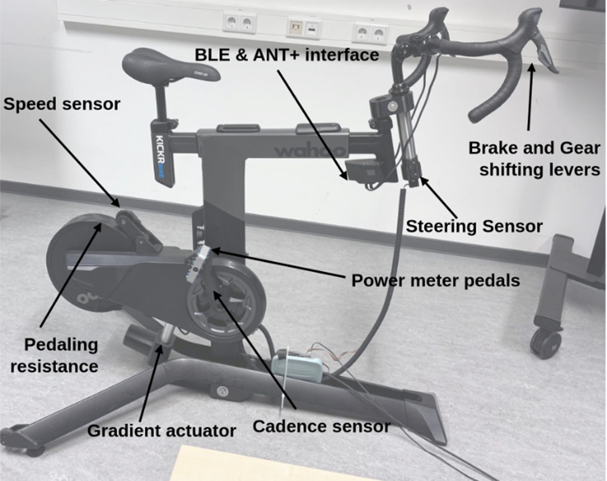
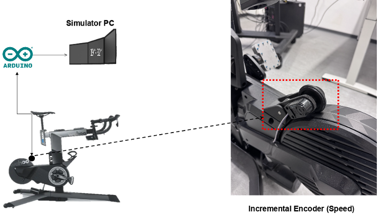

This documentation explains how to manufacture and assemble a friction wheel speed sensor for measuring the spinning frequency of a Wahoo Kickr Bike (or any other bicycling trainer with a flywheel) in bicycling simulator applications.
# Introduction 
In a bicycling simulator experiment, the update rate and latency of the speed signal are critical not only for accurate data collection but also for generating realistic sensory cues that support immersive virtual environments. A fluid, lag-free visualization of the bicycle avatar moving through the virtual scene requires speed input with sufficiently high update frequency and minimal latency, ensuring the visual output responds promptly to the user’s pedalling actions.

To maintain perceptual realism, the update rate of the speed signal must exceed the visual rendering rate, which in turn must surpass the threshold of human visual perception. Similarly, latency in the speed signal must remain below the level at which delays become perceptible and disruptive to the user. These requirements establish a hierarchy of update rates and latency tolerances that directly impact the quality of the simulation experience.

Despite this, current visualization systems face hardware and software limitations. In the TiptoP bicycling simulator, the virtual environment is rendered using CARLA, which supports a maximum visual update rate of 16 Hz. In contrast, the Wahoo Kickr Bike, which provides pedalling resistance, outputs speed and power data at only 1 Hz, and transmits this data wirelessly via Bluetooth or ANT+—protocols known to introduce variable and uncontrollable latency. These limitations can lead to unrealistic or disorienting visual feedback, particularly during periods of acceleration or deceleration.

To address this, an additional sensor with higher temporal resolution and lower latency was integrated into the setup. Specifically, an optical incremental encoder with 1000 counts per revolution was mechanically coupled to the Wahoo Kickr flywheel. Due to a gear ratio in the coupling mechanism, this configuration yields an effective resolution of 20,000 counts per crank revolution. For typical cadences ranging from 30 to 90 revolutions per minute, this translates to update rates between 10,000 and 30,000 Hz—far exceeding the required threshold and effectively eliminating speed signal latency as a limiting factor in simulation realism by direct wired connection to the simulation computer.

In a bicycling simulator, the speed of the bicycle avatar in the virtual environment is updated based on a speed input variable dependent on the human pedalling motion. This input needs to be of high update rate and lowest latency to obtain a fluid visualization of the simulation. The ideal update rate for the visualization is to be higher than the frequency with which the human brain processes visual sensory perceptions. However, technical limitations of the visualization hardware and software limit the maximum updating frequency. Thus, it is important that the speed signal does not further constrain the capabilities of the visualization hardware and software.

When off-the-shelf pedalling resistance modules are used, the provided speed signals are often limited to 1Hz update rate or slower and come with high latency due to wireless transmission via Bluetooth or ANT+ interfaces. For use in a bicycling simulator, researchers often equip them with an additional sensor to measure the speed at a rotating part of the pedalling resistance module or bicycle mock-up. Sensor technologies used for measuring the speed include Hall effect sensors, optical rotary encoders, side-runner dynamos, and inertial measurement modules which are implemented with very individual mechanical designs to fit to the prevailing pedalling resistance module and bicycle mock-up used.

To create a speed measuring module which can be adapted to any simulator, we developed a design bases on a friction wheel which can easily be attached to a rotating part. The rotation rate is measured using an optical rotary encoder with 1000 increments per turn to get a signal with high frequency.

The signal is read by an Arduino Uno microcontroller which converts it to a speed signal, taking into account the circumferences of the friction wheel and rotating part. The resulting speed is then communicated to the simulation computer via UDP over Ethernet.

In summary, this technical overview provides a detailed blueprint for integrating and wiring the speed sensor module, ensuring accurate speed data transmission for simulation applications. The software code is documented in a separate document. References to external documents are given at the relevant sections of this document.

This documentation presents an open-source speed measuring module developed for use in indoor cycling simulators, with the goal of enabling accurate, high-frequency, low-latency speed measurement in real-time simulation environments. It provides detailed building instructions to support reproduction and reuse in other simulator setups, while also offering comprehensive technical information to facilitate transparent comparison with other simulator technologies.

<a id="Figure_1"></a>

*Figure 1 System overview: Sensors and actuators*
# Technical Overview

## Speed Sensor Module Connection to Kickr Bike


<a id="Figure_2"></a>

*Figure 2 Mechanical integration - Speed Sensor Module Connection to Arduino*


<a id="Figure_3"></a>

*Figure 3 Speed sensor signal transmission and processing*

Note: The steering sensor is shown above ([Figure 3](#Figure_3)) is for representation of the simulator system. However, there lies a separate documentation for steering which holds the same structure of presentation as the speed sensor.

### System Integration and Function

As depicted in [Figure 2](#Figure_2), the speed sensor module is mechanically integrated with the Kickr Bike using a small pivoting arm mechanism. This mounting design uses a spring to ensure that the encoder maintains reliable contact with the flywheel, compensating for minor misalignment without mechanical interference or binding.

The incremental encoder captures mechanical wheel rotation and converts it to a digital signal which indicates variations in rotation rate by corresponding frequency of the signal. This signal is then transmitted to the Arduino. The Arduino performs real time signal processing to determine the rotational speed and converts it into standard units (e.g., km/h). This data is packaged and sent via Ethernet using a dedicated Arduino shield and is finally transmitted to a simulation PC running the CARLA environment.

As shown in the functional block diagram, the Arduino handles:
·      Sensor signal reading from the speed encoders,
·      Data conversion from counts per time to lateral speed,
·      UDP-based data communication with the simulator PC.

This seamless hardware to software loop enables real time monitoring of the bicyclist’s pedaling speed for accurate simulation feedback.

**Having outlined the system integration, we now examine the specific wiring necessary to accurately connect the sensor to the Arduino for reliable signal transmission****.**
## Speed Sensor Wiring to Arduino 

<a id="Figure_4"></a>

*Figure 4 Electrical integration - Speed Sensor Wiring Connection to Arduino*

 **Table 1 Speed Sensor Wiring**

| Encoder Wire | **Arduino Pin**   |
| ------------ | ----------------- |
| 1            | GND               |
| 2            | **Not connected** |
| 3            | D2 (INT0)         |
| 4            | 5 V               |
| 5            | D3 (INT1)         |

<a id="Figure_5"></a>

*Figure 5 Speed Sensor Wiring connection through Arduino to simulator software*
### Connection Overview and Hardware
The diagram above illustrates how the speed sensor module is connected to the Arduino Uno to enable rotational speed measurementon the Kickr Bike. Each pin on the sensor corresponds to a specific function and is wired directly to a compatible Arduino pin: **Power Supply (5 V & GND)** - The sensor is powered through the Arduino's 5 V and GND pins, connected to encoder wires **4** and **1** respectively. **Signal Pins (Channel A & B)** - Encoder wires **3** and **5** are used for signal transmission. They are connected to Arduino digital pins **D2 (INT0)** and **D3 (INT1)**, enabling the detection of rising/falling signal edges.

This setup allows the Arduino to count encoder pulses and calculate speed using interrupts. Ensuring proper wiring is essential for accurate and reliable speed measurements. Please make sure to attach all wires carefully to your simulator to prevent tripping hazards and signal disconnection.
## Assembly Drawing and Bill of Materials (BOM)


<a id="Figure_6"></a>

*Figure 6 Assembled View of the Speed Sensor
<a id="Figure_7"></a>

*Figure  7 Exploded View of the Speed Sensor*
<a id="Figure_8"></a>

*Figure  8 Assembly Drawing of the Speed Sensor*

**Table 2 Bill of Materials (BOM)**

| **Item** | **Qty** | **Part Name**                                               | **Part Number / Reference** | **Material / Standard**                        | **Remarks**                                                                                                                                                                                                |
| -------- | ------- | ----------------------------------------------------------- | --------------------------- | ---------------------------------------------- | ---------------------------------------------------------------------------------------------------------------------------------------------------------------------------------------------------------- |
| 1        | 1       | Measuring Wheel                                             | Measuring_wheel_V1          | 3D Filaments PLA (1.75 mm)                     | [3D Filaments PLA link](https://www.3dmensionals.de/3dmensionals-pla-filament-2580?number=PSU3DM001V.2#attr=11255,11254,11271,4165,4164,21806,23697,24892,25436)                                           |
| 2        | 1       | Optical Encoder                                             | HEDM-5500_13_V1             | ABS Plastic                                    | Avago series encoder                                                                                                                                                                                       |
| 3        | 1       | Sealing Ring                                                | ISO3601/1-B-NBR70-50x5      | NBR Rubber                                     | Standard O-ring (ISO)                                                                                                                                                                                      |
| 4        | 2       | Ball Bearing                                                | F688ZZ_V1                   | Steel, Alloy                                   | 8×16×5 mm deep groove bearing                                                                                                                                                                              |
| 5        | 2       | Shimming Washer                                             | DIN 988 8x0.2               | Steel, Low Alloy                               | [Conrad Part Link](https://www.conrad.de/de/p/stahl-anlaufscheibe-8-mm-14-mm-0-2-mm-20-st-216240.html)                                                                                                     |
| 6        | 5       | Fillister Head Screw  <br>(3 in encoder)  <br>(2 in spring) | M2.5 × 8                    | Steel, Zn-coated                               | [TOOLCRAFT screws](https://www.conrad.de/de/p/toolcraft-to-5430867-linsenzylinderschrauben-m2-5-8-mm-kreuzschlitz-phillips-stahl-galvanisch-verzinkt-200-st-1810289.html); not shown in CAD for simplicity |
| 7        | 1       | Position Ring                                               | Pos-ring_d8_D12_t5_M3_V1    | Brass                                          | [Modelcraft Part](https://www.conrad.de/de/p/modelcraft-stellring-passend-fuer-welle-details-8-mm-aussen-durchmesser-12-mm-dicke-5-mm-10-st-225550.html)                                                   |
| 8        | 2       | Shaft (Precision)[[1]](#_msocom_1)                          | Wheel_shaft_D8_V1           | Precision Steel 8h6, 1.4301                    | [Reely shaft – Conrad](https://www.conrad.de/de/p/silberstahl-welle-reely-o-x-l-8-mm-x-500-mm-237205.html)                                                                                                 |
| 9        | 1       | Lever Arm                                                   | Lever_V1                    | 3DFilaments PLA (1.75 mm)                      | 3D printed component                                                                                                                                                                                       |
| 10       | 1       | Joint Flange                                                | Joint_flange_V1             | 3DFilaments PLA (1.75 mm)                      | 3D printed component                                                                                                                                                                                       |
| 11       | 1       | Socket Connector                                            | Molex KK 254 (5-channel)    | Plastic + Gold Pins                            | [Socket #2447788 + pins](https://www.molex.com/)                                                                                                                                                           |
| 12       | 1       | Extension Spring                                            | Extension Spring            | Ø 0.63 x 8.6 x 46.4 mm / 180°, stainless steel | [**Extension Spring**](https://www.federnshop.com/en/products/extension_springs/rz-054ai.html)                                                                                                             |
#### Notes for Assembly and CAD  model:

- **Screws Not Modeled**: While the _M2.5 x 8_ fillister head screws were used in the physical build, these have been neglected to reduce CAD clutter.
- **Connector Details**: The Molex KK 254 series connector is recommended by the encoder manufacturer for sensor wiring. Ensure proper crimping and pin order during wiring.
- **O-Ring Standard**: The rubber sealing ring follows **ISO 3601-1** specification (NBR70) and provides axial sealing between components.
- **Precision Shaft**: The shaft is made of stainless precision steel (grade 1.4301) with 8h6 tolerance for accurate bearing fit. Cut to size from stock (500 mm length originally).

#### Sensor Parts and Usage:

1. **Measuring Wheel**
	The measuring wheel is mounted on the pivoting arm and directly contacts the flywheel to measure rotation. Only one is needed because we’re measuring one wheel at a time.
2. **Optical Encoder (HEDM-5500)**
	The encoder reads the motion of the measuring wheel. One encoder is enough for a single speed measurement setup.
3. **Sealing Ring (O-Ring)**
	This rubber ring ensures tight axial placement and reduces vibrations or lateral movement. A single ring provides adequate sealing in this compact mechanism.
4. **Ball Bearings (F688ZZ)**
	The measuring wheel shaft is supported by **two bearings**, one on each side of the wheel, for stability and smooth rotation. One bearing alone would allow wobble.
5. **Shimming Washers (DIN 988 8x0.2)**
	These are used to fine-tune the axial position of the shaft or bearing typically one on each side or both behind a bearing to reduce slack.
6. **Fillister Head Screws (M2.5 × 8)**
	3 screws are used to fix the encoder onto the lever, and the the other two attaches the spring mechanism between the lever and joint flange. Total 5 screws are sufficient for a secure and functional setup
7. **Position Ring (Clamp Ring)**
	The position ring (clamp ring) is placed on the shaft to prevent it from sliding out or to secure it in position. One is enough per shaft in this context.
8. **Shaft (Precision Steel 8h6)**
	2 shafts are used to mount the measuring wheel and pass through the encoder and bearing assembly. The one serves as the main rotational axis. The other is attached between the joint flange and the lever
9. **Lever Arm**
	This 3D printed arm holds the encoder and provides the pivoting function. Only one is required for a single speed sensor mount.
10. **Joint Flange**
	This flange connects the pivoting mechanism to the main assembly or frame and allows a spring or joint movement. One is sufficient for a stable base.
11. **Molex Socket Connector (5-pin)**
	This connector enables the interface between the encoder and Arduino. One 5-channel connector matches the number of wires from the encoder.
12. **Tension Spring**
	The spring ensures that the measuring wheel maintains consistent contact with the flywheel of the Kickr Bike. Its tension allows the wheel to stay pressed against the surface, make sure it fits cleanly withou any irregularities. If a bump is encountered, the spring allows the measuring wheel to momentarily deflect and then return to contact. Such obstructions can often be identified by unusual noise during operation. To ensure accurate sensor readings, the flywheel surface should be kept clean and free of debris.
# Building Instructions
## Mechanical Assembly
The following steps provide a clear procedure to ensure your mechanical assembly of the Speed Sensor is precise and reliable.
#### 1. Preparation
Start by cleaning all the 3D printed parts—these include positions 1,9 and 10, Make sure to:
- Remove any leftover plastic or rough edges.
- Lightly sand or round off any sharp corners so that all joining surfaces are smooth and flush.
Next, gather all the necessary hardware and adhesives:
- **Glue**: Use rapid-setting cyanoacrylate (also called “seconds” glue) for bonding plastic components.
- **Ball Bearings**: F-688 type, quantity: 2 (Position 4).
- **Shimming Washers**: Flat metal washers, quantity: 2 (Position 5).
- **Lock Ring**: Retaining ring (Position 6).
- **Screws**: Small _M2.5 x 8_ fillister head screws for securing the encoder’s bottom plate.
- **Connector Housing** (Position 10) and Molex Socket Connector Housing
- **Joint Shaft** (Position 11) and **Extension Spring** (Position 12).
#### 2. Assembling the Main Body and Ceiling Ring
1. Place the sealing ring (Position 3) into the groove of the measuring wheel (Position 1).
2. Apply a small amount of rapid glue around the joint.
3. Press the pieces together firmly and wait a few seconds for the glue to set before continuing.
4. Check the concentricity of the sealing ring outer diameter with the bore of the measuring wheel. Use a belt grinder to grind of any eccentricity at the sealing ring and to give it a flat outer circumference which connects thoroughly to the flywheel of the Kickr Bike later.
#### 3. Assembling the Lever and Bearing Stack (“Sandwich”)
1. Insert both ball bearings (Position 4) into the outer sides of the lever arm (Position 8).
2. From the other side, push the wheel shaft (Position 7) through this bearing until it just passes through.
3. In this order, slide onto the shaft: One flat washer (Position 5), the rubber-lined measuring wheel, and another flat washer (Position 5).
4. Push the shaft further until it seats into the second bearing pocket on the opposite side of the lever.
5. Install the lock ring (Position 6) onto the groove in the shaft to secure the bearing assembly. Do not fully tighten it yet—leave a little movement so the encoder can be installed later.
#### 4. Installing the Encoder
1. Use a small flat-head screwdriver to remove the bottom plate of the encoder by pressing the snap notches underneath.
2. Align the bottom plate with the lever (Position 8) and fasten it using the _M2.5 x 8_ fillister head screws
3. Carefully push the encoder with the bore in the center of its wheel onto the shaft. Snap the main encoder body onto the shaft until it clicks firmly into the bottom plate.
4. Tighten the encoder’s clamp screw onto the shaft to hold it securely in place.
5. Remove the hex key from the encoder and close the opening in the encoder housing by turning the cap according to the suppliers manual.
#### 5. Attaching the Joint Flange and Spring
1. Slide the joint shaft (Position 11) through the flange, then through the lever sub-assembly so it extends out the other side.
2. Insert one _M2.5 x 8_ fillister head screw into the Joint Flage and one into the lever. Hook the tension spring (Position 12) onto the screw heads in the lever arm on one end and on the flange on the other end. Once installed on the Kickr Bike this provides a restoring force that pulls the measuring wheel against the flywheel of the Kickr Bike.
#### 6. Connecting the Wiring and Securing the Clip
1. Prepare the wiring: Crimp the wires onto the encoder-compatible pins
2. Push the pins into the connector socket and make sure to push them into the right socket holes according to the connection plan (shown in Figure 3 and 4 above). 
3. Plug the connector housing (Position 10) onto the encoder pins.
4. Secure the connection by screwing on the 3D-printed locking clip over the joined connectors to prevent accidental disconnection.
#### 7. Final Assembly and Testing
1. Attach the complete measuring-arm assembly to your pedaling resistance unit or bicycle mockup using either strong double-sided tape or screws.
2. Perform a functionality check:
	1. Move the lever through its range of motion and ensure it rotates smoothly.
	2. Turn the flywheel of your pedaling resistance unit. First at slow speeds then at faster speeds and make sure the measuring wheel has a thorough friction connection to the flywheel over the whole speed range.
	3. Confirm that the encoder is registering movement or count changes.
	4. Confirm that the encoder registers incremental counts smoothly and continuously when rotating the measuring wheel. Ideally, validate this through software to ensure the signals correlate accurately to the mechanical motion.
#### **Tips & Notes**
- Always refer to the encoder’s official documentation for the correct torque settings on the clamp screw and to verify pin-out configurations.
- If any step seems unclear, consider recording the process and comparing it to this guide to spot discrepancies or mistakes.

**Troubleshooting Tips:**
- If the encoder fails to register signals, check wiring connections carefully against provided diagrams ([Figure 3](#Figure_3) and [Figure 4](#Figure_4)).
- Verify proper alignment and smooth rotation of mechanical parts if resistance or noise occurs during testing.
## 3D Print Information 
To fabricate the mechanical components of the speed sensor system, we employed Fused Filament Fabrication (FFF) (a common 3D printing method that extrudes molten plastic layer by layer) using a Prusa i3 MK3 3D printer. This section provides key technical parameters and setup configurations to ensure reproducibility of the print results with similar quality and structural integrity.

**Table 3 3D printing information**

| **Parameter**        | **Value**                                      |
| -------------------- | ---------------------------------------------- |
| Printer Model        | Prusa i3 MK3                                   |
| Slicing Software     | PrusaSlicer 2.9.1 (based on Slic3r)            |
| Layer Height         | 0.15 mm (fine resolution)                      |
| Infill Density       | 20%                                            |
| Infill Pattern       | Default (as configured in slicer)              |
| Supports             | Enabled (automatically generated)              |
| Material Type        | PLA (assumed default for ABS-compatible setup) |
| Estimated Print Time | ~5 hours 33 minutes (total)                    |
| Filament Consumption | ~29.32 meters (~70,523 mm³)                    |

Note: Automatic supports were essential for maintaining bore hole geometry, particularly in overhang regions where drooping or collapse may otherwise occur during printing.

Additional Recommendations:
- Post-processing: After printing, components were deburred and cleaned to remove any support material and residual brim structures. This ensures tight fits between bearings, shafts, and sensor housings.
- Tolerance Fit: It is recommended to maintain ±0.05 mm tolerance for critical bore fits, especially for bearing seats and shaft passages.

<a id="Figure_9"></a>

*Figure 9 Screenshot Prusa G-code Viewer*

The screenshot ([Figure 9](#Figure_9)) from Prusa G-code Viewer shows the exact layout and orientation of all parts on the printer tray during printing. This is critical for:
- Ensuring flat-base printing and stable adhesion to the build plate
- Maintaining correct dimensional references for mating parts
- Minimizing support material in critical surface areas

The g-code can be found under following file path:
```
CAD_and_print\\speed_sensor_1.0\\3D-print\\speed_measuring_V1.gcode
```
# Software
The software for the Arduino and the interface to the simulation computer is documented in a separate repository which can be found under following link:

```
\>\>\>\>\>\>\>\>\>\>\>\> ADD LINK TO ABOOZAR'S DOC\<\<\<\<\<\<\<\<\<\<\<
```
